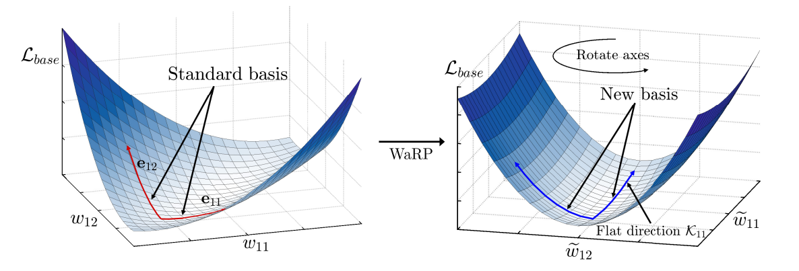

# Warping the Space: Weight Space Rotation for Class-Incremental Few-Shot Learning


This repository contains the official implementation code for paper titled "[Warping the Space: Weight Space Rotation for Class-Incremental Few-Shot Learning](https://openreview.net/forum?id=kPLzOfPfA2l)" accepted at ICLR 2023 as a <span style="color:orange">**Spotlight (notable-top-25%)**</span>.

**Abstract:**
Class-incremental few-shot learning, where new sets of classes are provided sequentially with only a few training samples, presents a great challenge due to catastrophic forgetting of old knowledge and overfitting caused by lack of data. During finetuning on new classes, the performance on previous classes deteriorates quickly even when only a small fraction of parameters are updated, since the previous knowledge is broadly associated with most of the model parameters in the original parameter space. In this paper, we introduce WaRP, the *weight space rotation process*, which transforms the original parameter space into a new space so that we can push most of the previous knowledge compactly into only a few important parameters. By properly identifying and freezing these key parameters in the new weight space, we can finetune the remaining parameters without affecting the knowledge of previous classes. As a result, WaRP provides an additional room for the model to effectively learn new classes in future incremental sessions. Experimental results confirm the effectiveness of our solution and show the improved performance over the state-of-the-art methods.



## Step-by-Step Guide to Running Our Code


### 1. Clone this repository
```
git clone https://github.com/EdwinKim3069/WaRP-CIFSL.git
cd WaRP-CIFSL
```

### 2. Preparing datasets

``CIFAR100`` dataset will be automatically downloaded when running the code. Regarding ``MiniImagenet`` and ``CUB200`` datasets, you can download from [[MiniImagenet]](https://drive.google.com/file/d/1eV1TGCC8h4Ga47PRRNiy4XdGbx3hfTyw/view?usp=drive_link) and [[CUB200]](https://drive.google.com/file/d/110xuDVF-cSb8RlLjz0rV8EdlSpIALceN/view?usp=drive_link). 

**For MiniImagenet:**
```
cd data                                         # go to data directory
gdown 1eV1TGCC8h4Ga47PRRNiy4XdGbx3hfTyw
tar -xvf miniimagenet.tar
rm -f miniimagenet.tar
cd ..
```


**For CUB200:**
```
cd data                                       
gdown 110xuDVF-cSb8RlLjz0rV8EdlSpIALceN
tar -xvzf CUB_200_2011.tgz
rm -f CUB_200_2011.tgz
cd ..
```

### 3. Pretraining the model & Running incremental sessions with WaRP

Excuting a script file in the ``script`` folder pretrains the model, and then immediately runs incremental sessions with WaRP using pretrained model as follows.

**CIFAR100:**
```
bash script/run_cifar100.sh
```

**MiniImagenet:**
```
bash script/run_mini-imagenet.sh
```

**CUB200:**
```
bash script/run_cub200.sh 
```


If you already have pretrained the model, comment out the script code for pretraining and execute the script file as shown below.


```bash
# echo "Start Pretraining"
seed_num=0
gpu_num=0

# python train.py -project base \
#         -dataset cifar100 \
#         -base_mode ft_dot \
#         -new_mode avg_cos \
#         -gamma 0.1 \
#         -lr_base 0.1 \
#         -decay 0.0005 \
#         -epochs_base 210 \
#         -schedule Milestone \
#         -milestones 120 150 180 \
#         -gpu $gpu_num \
#         -temperature 16 \
#         -start_session 0 \
#         -batch_size_base 128 \
#         -seed $seed_num

echo "Run WaRP for Incremental Sessions"
model_directory="checkpoint/cifar100/base/ft_dot-avg_cos-data_init-start_0/Epo_210-Lr_0.1000-MS_120_150_180-Gam_0.10-Bs_128-Mom_0.90-Wd_0.00050-seed_$seed_num-T_16.00/session0_last_epoch.pth"

python train.py -project base \
        -dataset cifar100 \
        -new_mode ft_cos \
        -gamma 0.1 \
        -lr_base 0.1 \
        -decay 0.0005 \
        -epochs_base 0 \
        -temperature 16 \
        -start_session 0 \
        -model_dir $model_directory \
        -gpu $gpu_num \
        -lr_new 0.01 \
        -epochs_new 30 \
        -fraction_to_keep 0.1 \
        -seed $seed_num
```

### Prototype-based method (simple yet strong baseline)

Prototype-based baseline is a method where the embeddings are averaged corresponding to each class (a.k.a. prototype) and the model makes prediction based on it. You can reproduce this simple yet strong baseline by inserting ``avg_cos`` in ``new_mode`` argument instead of ``ft_cos`` as follows.

```bash
echo "Run WaRP for Incremental Sessions"
model_directory="checkpoint/cifar100/base/ft_dot-avg_cos-data_init-start_0/Epo_210-Lr_0.1000-MS_120_150_180-Gam_0.10-Bs_128-Mom_0.90-Wd_0.00050-seed_$seed_num-T_16.00/session0_last_epoch.pth"

python train.py -project base \
        -dataset cifar100 \
        -new_mode avg_cos \
        -gamma 0.1 \
        -lr_base 0.1 \
        -decay 0.0005 \
        -epochs_base 0 \
        -temperature 16 \
        -start_session 0 \
        -model_dir $model_directory \
        -gpu $gpu_num \
        -lr_new 0.01 \
        -epochs_new 30 \
        -fraction_to_keep 0.1 \
        -seed $seed_num
```


## Acknowledgment

Our source code is built upon the implementations from [CEC-CVPR2021](https://github.com/icoz69/CEC-CVPR2021) and [fscil](https://github.com/xyutao/fscil) repositories.


## References

If you find our project useful for your future research, we would appreciate it if you could consider citing our paper using the following BibTex entry.
```BibTeX
@inproceedings{
    kim2023warping,
    title={Warping the Space: Weight Space Rotation for Class-Incremental Few-Shot Learning},
    author={Do-Yeon Kim and Dong-Jun Han and Jun Seo and Jaekyun Moon},
    booktitle={The Eleventh International Conference on Learning Representations},
    year={2023},
}
```